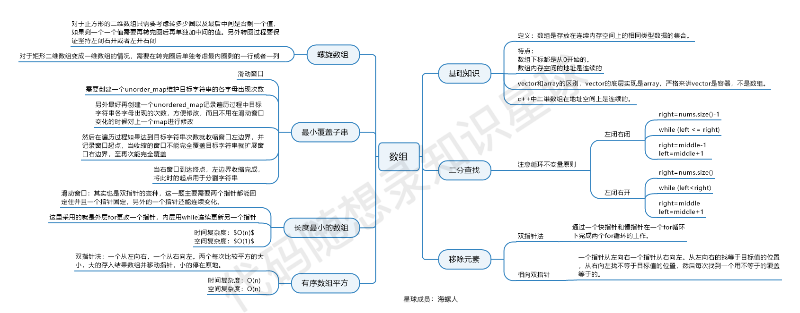
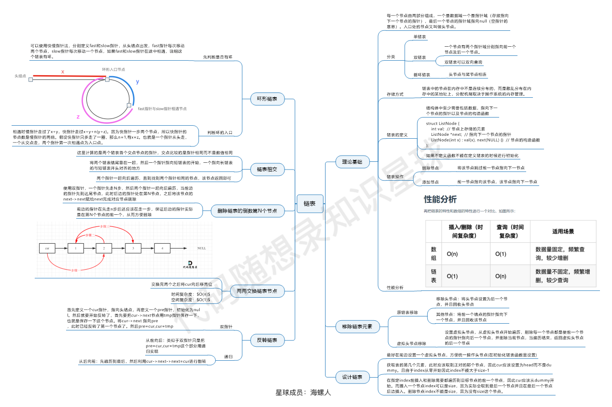
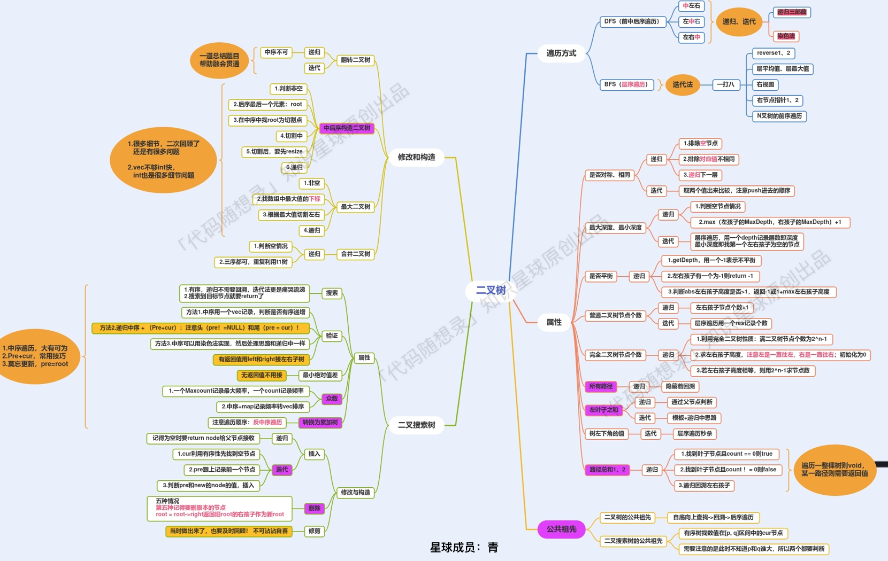
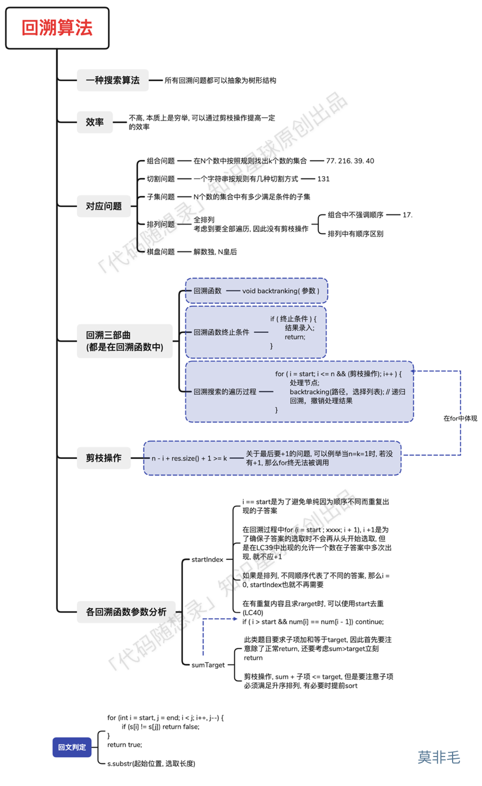
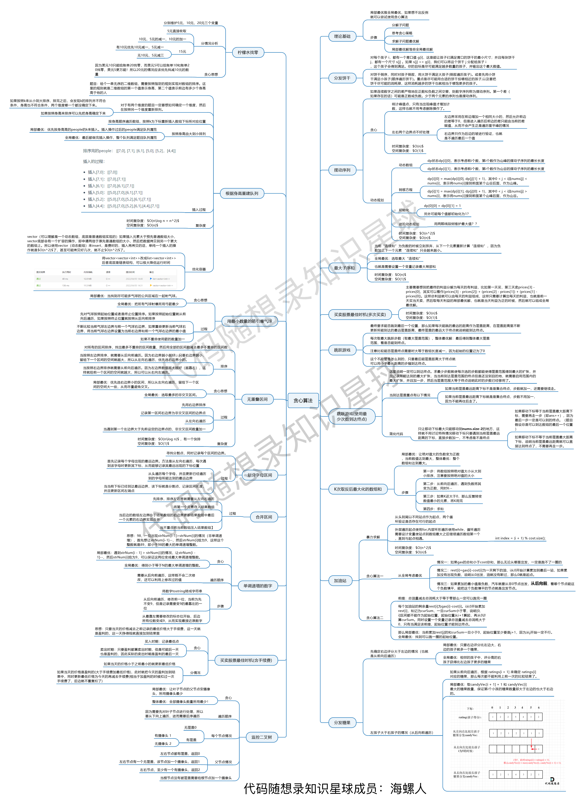
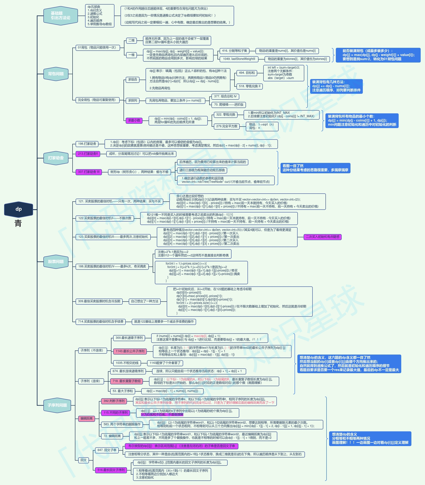

## LC刷题笔记 [https://programmercarl.com/]
### 数组:[https://programmercarl.com/%E6%95%B0%E7%BB%84%E6%80%BB%E7%BB%93%E7%AF%87.html#%E4%BA%8C%E5%88%86%E6%B3%95]
  - 
### 链表:[https://programmercarl.com/%E9%93%BE%E8%A1%A8%E6%80%BB%E7%BB%93%E7%AF%87.html#%E9%93%BE%E8%A1%A8%E7%9A%84%E7%90%86%E8%AE%BA%E5%9F%BA%E7%A1%80]
  - 
### hashtable: [https://programmercarl.com/%E5%93%88%E5%B8%8C%E8%A1%A8%E6%80%BB%E7%BB%93.html#%E6%95%B0%E7%BB%84%E4%BD%9C%E4%B8%BA%E5%93%88%E5%B8%8C%E8%A1%A8]
  - hashtable经常是作为一个辅助结构，考虑使用数组还是哈希表进行hash，能用数组就用数组 
### 字符串: [https://programmercarl.com/%E5%AD%97%E7%AC%A6%E4%B8%B2%E6%80%BB%E7%BB%93.html]
### 双指针: [https://programmercarl.com/%E5%8F%8C%E6%8C%87%E9%92%88%E6%80%BB%E7%BB%93.html]
  - kmp算法是重点，要多练多理解跳跃的逻辑
### 双指针方法: [https://programmercarl.com/%E5%8F%8C%E6%8C%87%E9%92%88%E6%80%BB%E7%BB%93.html]
### stack和queue: [https://programmercarl.com/%E6%A0%88%E4%B8%8E%E9%98%9F%E5%88%97%E6%80%BB%E7%BB%93.html#%E6%A0%88%E5%9C%A8%E7%B3%BB%E7%BB%9F%E4%B8%AD%E7%9A%84%E5%BA%94%E7%94%A8]
### 二叉树: [https://programmercarl.com/%E4%BA%8C%E5%8F%89%E6%A0%91%E6%80%BB%E7%BB%93%E7%AF%87.html]
  - 搜索树中序遍历是有序数组
  - 前序数组根节点是第一个元素，后序数组根节点是最后一个
  - 二叉树中也可以使用双指针，需要在每次处理节点的时候更新指针节点
  - 二叉搜索树中序后继节点为节点右子树最左元素
  - 累加和二叉树可以通过观察从二叉树遍历的顺序来解
  - 
### 回溯：[https://programmercarl.com/%E5%9B%9E%E6%BA%AF%E6%80%BB%E7%BB%93.html#%E7%BB%84%E5%90%88%E9%97%AE%E9%A2%98-2]
  -  
  - 对一个array从左到右尝试把当前元素加入或不加入结果，一些注意的点：python里arr[:]会创一个copy，可重复用时从左到右时index不用增加
  - 去重时需要考虑能否通过变化的index去重，如果不行（比如全排列问题每次需要在bt里遍历所有元素），就必须要一个辅助数组来帮忙
  - 可以通过参数控制递归的深度以及筛选符合条件的元素
  - 要注意每次收集结果要在哪里收集，子集问题收集每个节点位置的path，而一般组合问题收集叶子节点的path，需要满足一定终止条件时才添加元素 或者可能在
  找到第一个结果的时候就返回
  - 数独问题需要对每个可以放数字的位置递归所有可能的数字，是一个二维递归问题
  - 皇后问题是一个对行递归，对列遍历的一维递归问题
### 贪心：[https://programmercarl.com/%E8%B4%AA%E5%BF%83%E7%AE%97%E6%B3%95%E6%80%BB%E7%BB%93%E7%AF%87.html]
  - 先跟着直觉走，找不到反例的话贪心策略就能成功
  - 思考方向：排序，简单尝试优先满足明显条件的case，整个数组从左到右从右到左，或者从左到右一次然后从右到左一次
  - 
### 动态规划: [https://programmercarl.com/%E5%8A%A8%E6%80%81%E8%A7%84%E5%88%92%E6%80%BB%E7%BB%93%E7%AF%87.html#%E5%8A%A8%E8%A7%84%E7%BB%93%E6%9D%9F%E8%AF%AD]
  - 

## LC 题目集合 [https://www.1point3acres.com/bbs/forum.php?mod=viewthread&tid=678970&page=1&authorid=682747]
- Website:
  - https://www.lintcode.com/accounts/signin?next=%2F
  - https://leetcode.com/
- 说明：每个大类按重要性递减，最优先为A
- [A： 各类型题目的典型模板题，基本需要刷十几遍，做到迷迷糊糊半昏迷状态也能熟练默写的肌肉记忆状态，任何情况下都要一遍写出来]: 
  - [3] LC0704: Binary Search LC704
  - [1] LC0033: Search in Rotated Sorted Array　
  - LC0081: Search in Rotated Sorted Array II
  - LC0912: Sort an Array (Quick Sort and Merge Sort)
  - LC0075: Sort an Array (Quick Sort and Merge Sort)
  - LC0021: Merge Two Sorted Lists
  - LN0391: Number of Airplanes in the Sky
  - LC0003: Longest Substring Without Repeating Characters
  - [3] LC0053: Maximum Subarray
  - [3] LC0001: Two Sum
  - LC0297: Serialize and Deserialize Binary Tree
  - LN0127: Topological Sorting
  - LC0200: Number of Islands (DFS/UnionFind)
  - LC0133: Clone Graph
  - [2] LC0094: Binary Tree Inorder Traversal
  - [2] LC0144: Binary Tree Preorder Traversal
  - [2] LC0145: Binary Tree Postorder Traversal
  - [1] LC0105: Construct Binary Tree from Preorder and Inorder Traversal
  - LC0173: Binary Search Tree Iterator
  - [1] LC0039: Combination Sum
  - [1] LC0040: Combination Sum II
  - [1] LC0046: Permutations
  - [1] LC0047: Permutations II
  - [3] LC0077: Combinations
  - [2] LC0078 Subsets
  - [4] LC0090: Subsets II
  - LC0002: Add Two Numbers
  - LC0021: Merge Two Sorted Lists
  - LC0706: Design HashMap
  - [1] LC0707: Design LinkedList
  - LC0023: Merge k Sorted Lists
  - LC0155: Min Stack
  - [1] LC0300: Longest Increasing Subsequence (Patience Sort)
  - LC0208: Implement Trie (Prefix Tree)
  - LC0307: Range Sum Query - Mutable
  - LC0146: LRU Cache
  - LC0460: LFU Cache
  - [1] LN0092: Backpack
  - LC0062: Unique Paths
  - LC0063: Unique Paths II 
- [B： 主要是各种高频题和经典题，基本在5~8遍以上，需要做到最优解，medium难度10分钟以内，hard难度15分钟以内，无错一遍过，同时要能解释清楚思路。另外有多重解法的也要掌握，知道不同解法间的优缺点和trade off原因，任何情况下都要一遍写出来]
  - [1] LC0034: Find First and Last Position of Element in Sorted Array
  - LC0702: Search in a Sorted Array of Unknown Size
  - LC0004: Median of Two Sorted Arrays
  - LC0074: Search a 2D Matrix
  - LC0162: Find Peak Element
  - LC0875: Koko Eating Bananas
  - LC1283: Find the Smallest Divisor Given a Threshold
  - LC0026: Remove Duplicates from Sorted Array
  - LC0080: Remove Duplicates from Sorted Array II
  - LC0088: Merge Sorted Array
  - [1] LC0283: Move Zeroes
  - LC0215: Kth Largest Element in an Array
  - [1] LC0347: Top K Frequent Elements
  - [1] LC0349: Intersection of Two Arrays
  - [1] LC0350: Intersection of Two Arrays
  - LC0845: Longest Mountain in Array
  - [1] LC0042: Trapping Rain Water
  - LC0043: Multiply Strings
  - LC0086: Partition List
  - [1] LC0141: Linked List Cycle
  - [1] LC0160: Intersection of Two Linked Lists
  - LC0234: Palindrome Linked List
  - LC0328: Odd Even Linked List
  - [1] LC0056: Merge Intervals
  - [1] LC0057: Insert Interval
  - LC0252: Meeting Rooms
  - LC0253: Meeting Rooms II
  - LC0986: Interval List Intersections
  - LC0005: Longest Palindromic Substring
  - LC0345: Reverse Vowels of a String
  - LC0680: Valid Palindrome II
  - LC0011: Container With Most Water
  - [1] LC0076: Minimum Window Substring
  - [1] LC0209: Minimum Size Subarray Sum
  - [3] LC0239: Sliding Window Maximum
  - LC0713: Subarray Product Less Than K
  - LC0295: Find Median from Data Stream
  - LC0238: Product of Array Except Self
  - LC0303: Range Sum Query - Immutable
  - LC0325: Maximum Size Subarray Sum Equals k 
  - LC0528: Random Pick with Weight
  - LC0560: Subarray Sum Equals K
  - [4] LC0015: 3Sum
  - [4] LC0018: 4Sum 
  - LN0382: Triangle Count
  - [1] LC0102: Binary Tree Level Order Traversal
  - LC0103: Binary Tree Zigzag Level Order Traversal
  - [1] LC0107: Binary Tree Level Order Traversal II
  - [1] LC0513: Find Bottom Left Tree Value
  - LC0207: Course Schedule
  - LC0210: Course Schedule II
  - LC0269: Alien Dictionary
  - LC0490: The Maze
  - LC0505: The Maze II
  - LC0542: 01 Matrix
  - LC0733: Flood Fill
  - LC0994: Rotting Oranges
  - LC0127: Word Ladder
  - LC0261: Graph Valid Tree
  - LC0841: Keys and Rooms
  - [1] LC0106: Construct Binary Tree from Inorder and Postorder Traversal
  - LC0889: Construct Binary Tree from Preorder and Postorder Traversal
  - LC0230: Kth Smallest Element in a BST
  - LC0285: Inorder Successor in BST
  - [1] LC0098: Validate Binary Search Tree
  - [1] LC0100: Same Tree
  - [1] LC0101: Symmetric Tree 
  - [1] LC0110: Balanced Binary Tree
  - [1] LC0111: Minimum Depth of Binary Tree
  - [1] LC0112: Path Sum
  - [1] LC0113: Path Sum II
  - LC0124: Binary Tree Maximum Path Sum
  - [2] LC0235: Lowest Common Ancestor of a Binary Searh Tree
  - [2] LC0236: Lowest Common Ancestor of a Binary Tree
  - [1] LC0199: Binary Tree Right Side View
  - LC0513: Find Bottom Left Tree Value
  - LC0331: Verify Preorder Serialization of a Binary Tree
  - LC0449: Serialize and Deserialize BST
  - [1] LC0017: Letter Combinations of a Phone Number
  - LC0022: Generate Parentheses
  - [2] LC0051: N-Queens
  - LC0254: Factor Combinations
  - LC0301: Remove Invalid Parentheses
  - [1] LC0491: Increasing Subsequences
  - LC0113: Path Sum II
  - [1] LC0257: Binary Tree Paths
  - LN0246: Binary Tree Path Sum II
  - LN0376: Binary Tree Path Sum
  - LN0472: Binary Tree Path Sum III
  - LC0140: Word Break II
  - LC0494: Target Sum
  - LC1192: Critical Connections in a Network
  - LC0442. Find All Duplicates in an Array
  - LC0048. Rotate Image
  - LC0054. Spiral Matrix
  - LC0073. Set Matrix Zeroes
  - LC0289. Game of Life
  - LC0006. ZigZag Conversion
  - LC0013. Roman to Integer
  - [1] LC0014. Longest Common Prefix
  - LC0068. Text Justification
  - LC0443. String Compression
  - LC0025: Reverse Nodes in k-Group
  - LC0082: Remove Duplicates from Sorted List II
  - LC0083: Remove Duplicates from Sorted List
  - LC0086: Partition List
  - LC0092: Reverse Linked List II
  - LC0138: Copy List with Random Pointer
  - [1] LC0141: Linked List Cycle
  - LC0148: Sort List
  - [1] LC0203: Remove Linked List Elements
  - [2] LC0206: Reverse Linked List
  - LC0234: Palindrome Linked List
  - LC0328: Odd Even Linked List
  - LC0445: Add Two Numbers II
  - [1] LC0049: Group Anagrams
  - LC0128: Longest Consecutive Sequence
  - LC0560: Subarray Sum Equals K
  - LC0953: Verifying an Alien Dictionary
  - LC0295: Find Median from Data Stream
  - LC0347: Top K Frequent Elements
  - LC0692: Top K Frequent Words
  - LC0767: Reorganize String
  - LC0973: K Closest Points to Origin
  - [1] LC0020: Valid Parentheses
  - LC0085: Maximal Rectangle
  - LC0224: Basic Calculator
  - LC0227: Basic Calculator II
  - LC0394: Decode String 
  - LC1249: Minimum Remove to Make Valid Parentheses
  - [1] LC0084: Largest Rectangle in Histogram
  - LC0239: Sliding Window Maximum
  - LC1019: Next Greater Node In Linked List
  - LC0211: Design Add and Search Words Data Structure
  - LC0305: Number of Islands II
  - LC0252. Meeting Rooms
  - LC0253. Meeting Rooms II
  - LC0211: Design Add and Search Words Data Structure
  - LC0380: Insert Delete GetRandom O(1)
  - LC0528: Random Pick with Weight
  - LC0588: Design In-Memory File System
  - LC0981: Time Based Key-Value Store
  - LC1396: Design Underground System
  - [1] LN0125: Backpack II
  - [1] LN0440: Backpack III
  - [1] LC0139: Word Break
  - [1] LC0121: Best Time to Buy and Sell Stock
  - LC0010: Regular Expression Matching
  - LC0312: Burst Balloons
  - LC0516: Longest Palindromic Subsequence
  - LC0064: Minimum Path Sum
  - LC0085: Maximal Rectangle
  - LC0221: Maximal Square
  - LC0091: Decode Ways
  - LN0394: Coins in a Line
  - [1] LC0055: Jump Game
  - [1] LC0045: Jump Game II
  - [1] LC0763: Partition Labels
- [C： 核心题之外的高频题，基本在5遍左右。这样遇到原题或者类似题的时候，基本思路、逻辑不会错。能不能临场完全bug free要看基本功和运气。]
  - LC0153: Find Minimum in Rotated Sorted Array
  - LC0154: Find Minimum in Rotated Sorted Array II
  - LC0278: First Bad Version
  - LC0658: Find K Closest Elements
  - LC0302: Smallest Rectangle Enclosing Black Pixels
  - LC0852: Peak Index in a Mountain Array
  - [2] LC0069: Sqrt(x)
  - LN0183: Wood Cut
  - LN0437: Copy Books
  - LN0438: Copy Books II
  - LC0969: Pancake Sorting
  - LN0031: Partition Array
  - LN0625: Partition Array II
  - LN0143: Sort Color II
  - LN0461: Kth Smallest Numbers in Unsorted Array
  - LN0544: Top k Largest Numbers
  - [2] LC0142: Linked List Cycle II
  - LC0287: Find the Duplicate Number
  - LC0876: Middle of the Linked List
  - LC0125: Valid Palindrome
  - LC0395: Longest Substring with At Least K Repeating Characters 
  - LC0480: Sliding Window Median
  - LC0567: Permutation in String 
  - LC0727: Minimum Window Subsequence 
  - LN0604: Window Sum
  - LC0346: Moving Average from Data Stream
  - LC0352: Data Stream as Disjoint Intervals
  - LC0703: Kth Largest Element in a Stream
  - LC0167: Two Sum II - Input array is sorted 
  - LC0170: Two Sum III - Data structure design 
  - LC0653: Two Sum IV - Input is a BST 
  - LC1099: Two Sum Less Than K 
  - LC0259: 3Sum Smaller
  - LN0057: 3Sum Closest
  - LN0443: Two Sum - Greater than target
  - LN0533: Two Sum - Closet to target
  - LN0587: Two Sum - Unique pairs
  - LN0609: Two Sum - Less than or equals to target
  - LN0610: Two Sum - Difference equals to target
  - LN0242: Convert Binary Tree to Linked Lists by Depth
  - LC0444: Sequence Reconstruction
  - LC0305: Number of Islands II
  - LC0773: Sliding Puzzle
  - LN0573: Build Post Office II
  - LN0598: Zombie in Matrix
  - LN0611: Knight Shortest Path
  - LN0794: Sliding Puzzle II
  - LC0323: Number of Connected Components in an Undirected Graph
  - LC1306: Jump Game III
  - LN0531: Six Degree
  - LN0618: Search Graph Nodes
  - LN0624: Remove Substrings
  - LC0270: Closest Binary Search Tree Value
  - LC0272: Closest Binary Search Tree Value II
  - LC0510: Inorder Successor in BST II
  - LN0915: Inorder Predecessor in BST II
  - [1] LC0104: Maximum Depth of Binary Tree
  - LC0333: Largest BST Subtree
  - LN0596: Minimum Subtree
  - LN0597: Subtree with Maximum Average
  - LC0298: Binary Tree Longest Consecutive Sequence
  - LC0549: Binary Tree Longest Consecutive Sequence II
  - LN0475: Binary Tree Maximum Path Sum II
  - LN0619: Binary Tree Longest Consecutive Sequence III
  - LN0474: Lowest Common Ancestor II
  - LN0578: Lowest Common Ancestor III
  - LC0114: Flatten Binary Tree to Linked List
  - [1] LC0037: Sudoku Solver
  - [2] LC0052: N-Queens II
  - LC0093: Restore IP Addresses
  - [1] LC0131: Palindrome Partitioning
  - LN0010: String Permutation II
  - LN0570: Find the Missing Number II
  - LN0680: Split String
  - LC0126: Word Ladder II
  - LC0290: Word Pattern
  - LC0291: Word Pattern II
  - LC0142: Linked List Cycle II
  - LC0876: Middle of the Linked List
  - LC0290: Word Pattern
  - LC0480: Sliding Window Median
  - LC0703: Kth Largest Element in a Stream
  - LC1032: Stream of Characters
  - LC0323: Number of Connected Components in an Undirected Graph
  - LC0327: Count of Range Sum
  - LC0715: Range Module
  - LC0315: Count of Smaller Numbers After Self
  - LC0493: Reverse Pairs
  - [1] LN0562: Backpack IV
  - [1] LN0563: Backpack V
  - LN0564: Backpack VI (Combination Sum IV)
  - LN0971: Surplus Value Backpack
  - LC0474. Ones and Zeroes
  - [2] LC0122: Best Time to Buy and Sell Stock II
  - [1] LC0123: Best Time to Buy and Sell Stock III
  - [1] LC0188: Best Time to Buy and Sell Stock IV
  - LC0256: Paint House
  - LC0265: Paint House II
  - LC0843: Digital Flip
  - LC0044: Wildcard Matching
  - [1] LC0072: Edit Distance
  - LC0097: Interleaving String
  - [1] LC0115: Distinct Subsequences
  - [1] LC1143: Longest Common Subsequence
  - LC0087: Scramble String
  - LC0361: Bomb Enemy
  - LC0132: Palindrome Partitioning II
  - [1] LC0279: Perfect Squares
  - LC0639: Decode Ways II
  - LN0395: Coins in a Line II
  - LN0396: Coins in a Line III 
- [D： 上述题之外所有你刷过的题。基本上做过一两遍，有个思路，临场遇见了不会慌]
  - [1] LC0032: Longest Valid Parentheses 
  - [1] LC0035: Search Insert Position
  - [1] LC0367: Valid Perfect Square
  - [1] LC0583: Delete Operation for Two Strings 
  - [1] LC0392: Is Subsequence 
  - [1] LC1035: Uncrossed Lines
  - [1] LC0718: Maximum Length of Repeated Subarray
  - [1] LC0674: Longest Continuous Increasing Subsequence
  - [1] LC0309: Best Time to Buy and Sell Stock with Cooldown
  - [1] LC0337: House Robber III
  - [1] LC0213: House Robber II
  - [1] LC0198: House Robber I
  - [1] LC0377: Combination Sum IV
  - [1] LC0739: Daily Temperatures
  - [2] LC0027: Remove Element
  - [1] LC0977: Squares of a Sorted Array
  - [1] LC0904: Fruit Into Baskets
  - [2] LC0024: Swap Nodes in Pairs
  - [2] LC0019: Remove Nth Node From End of List
  - [1] LC0242: 242. Valid Anagram
  - [1] LC0383: Ransom Note
  - [1] LC0438: Find All Anagrams in a String
  - [1] LC0202: Happy Number
  - [3] LC0454: 4Sum II: Sum to 0
  - [2] LC0344: Reverse String
  - [1] LC0541: Reverse String II
  - [1] LC1644: Lowest Common Ancestor of a Binary Tree II (not necessarily in tree)
  - [1] LC1650: Lowest Common Ancestor of a Binary Tree III (with parent, in tree)
  - [1] LCCN剑指offer05: 替换空格
  - [2] LC0151: Reverse Words in a String
  - [1] LCCN剑指Offer58: II. 左旋转字符串
  - [6] LC0028: Find the Index of the First Occurrence in a String (KMP for strStr)
  - [1] LC0459: Repeated Substring Pattern
  - [1] LC0345: Reverse Vowels of a String
  - [1] LC0232: Implement Queue using Stacks
  - [1] LC0225: Implement Stack using Queues
  - [1] LC1047: Remove All Adjacent Duplicates In String
  - [1] LC0150: Evaluate Reverse Polish Notation
  - [1] LC0637: Average of Levels in Binary Tree
  - [1] LC0429: N-ary Tree Level Order Traversal
  - [1] LC0515: Find Largest Value in Each Tree Row
  - [1] LC0116: Populating Next Right Pointers in Each Node
  - [1] LC0116: Populating Next Right Pointers in Each Node II
  - [1] LC0226: Invert Binary Tree
  - [1] LC0572: Subtree of Another Tree
  - [1] LC0222: Count Complete Tree Nodes 
  - [1] LC0654: Maximum Binary Tree
  - [1] LC0700: Search in a Binary Search Tree
  - [1] LC0530: Minimum Absolute Difference in BST
  - [1] LC0501: Find Mode in Binary Search Tree
  - [2] LC0450: Delete Node in a BST
  - [3] LC0669: Trim a Binary Search Tree
  - [1] LC0108: Convert Sorted Array to Binary Search Tree
  - [1] LC0109: Convert Sorted List to Binary Search Tree
  - [1] LC0539: Minimum Time Difference
  - [1] LC0216: Combination Sum III
  - [1] LC0217: Contains Duplicate
  - [1] LC0219: Contains Duplicate II
  - [1] LC0492: Construct the Rectangle
  - [2] LC0332: Reconstruct Itinerary
  - [1] LC0455: Assign Cookies
  - [1] LC0376: Wiggle Subsequence
  - [1] LC2291: Maximum Profit From Trading Stocks
  - [1] LC1005: Maximize Sum Of Array After K Negations
  - [1] LC2099: Find Subsequence of Length K With the Largest Sum
  - [2] LC0134: Gas Station
  - [1] LC0135: Candy
  - [1] LC0136: Single Number
  - [1] LC0137: Single Number II
  - [1] LC0860: Lemonade Change
  - [1] LC0406: Queue Reconstruction by Height
  - [1] LC0452: Minimum Number of Arrows to Burst Balloons
  - [1] LC0435: Non-overlapping Intervals
  - 
  - [1] LC0509: Fibonacci Number
  - [1] LC0070: Climbing Stairs
  - 

