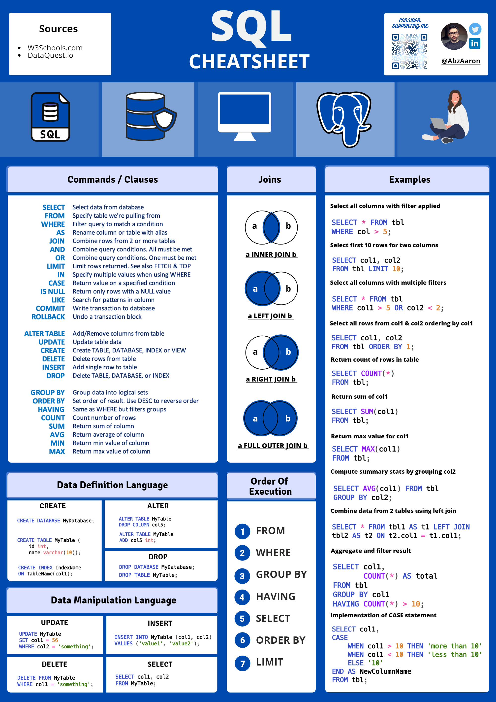

# sql 语法和模板总结
[https://github.com/ABZ-Aaron/CheatSheets/blob/main/SQL-V2-Dark.pdf]

## 基础函数
- SELECT * FROM: 从表格内选择列的语句
- WHERE/HAVING: 条件语句
- COUNT/SUM/AVG/MAX/MIN (aggregation function) 组内统计函数
- GROUP BY: 原表格根据某一些列进行分组并在组内进行计算和统计,在select语句的位置除了选择的列，统计的计数 COUNT(*)也要写上
- CASE WHEN:用于根据几列值的条件创造新的列
- JOIN: 连接两个表格
- WINDOW FUNCTION
- 其他算子 DATE,LIKE,DIFFDATE ...

## CASE WHEN
CASE
    WHEN Condition1 THEN Result1
    WHEN Condition2 THEN Result2 
    WHEN Condition3 THEN Result3
    ELSE RESULT4
END AS {NewColName}

## 模板
### 1. GROUP BY 计算
SELECT
    c1, c2, ... ,
Count/Avg/Sum/Max/Min(
    CASE WHEN ... THEN ...
         WHEN ... THEN ...
         ELSE ...
    END
)
FROM Table
WHERE ...
GROUP BY ...
(HAVING ...)

### 2. JOIN 连接table
SELECT
    a.c1, a.c2, ... , b.d1, b.d2, ...
FROM
    Table1 a (LEFT/FULL OUTER/INNER) JOIN 
    Table2 b 
        ON a.xx = b.xx/a.xx BETWEEN b.xx AND b.yy + 3
WHERE ...

### 3. WINDOW function
#### Rank
#### 累计求和

### 4.日常忘掉的syntax
- 列内没有记录但是需要选中时， WHERE {COL} is NULL    